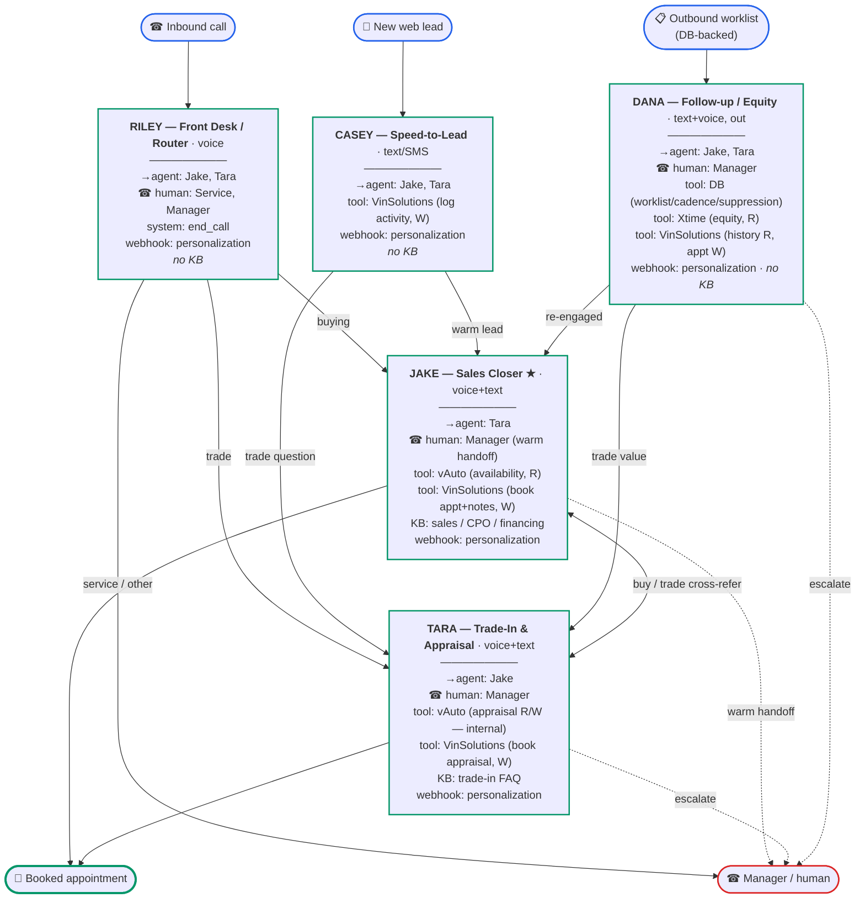

# BDC AI Agent Architecture

ElevenLabs Conversational AI runs the agents (STT + LLM(Opus) + TTS + turn-taking).
This repo's server is the **integration hub**: it feeds per-call lead context to the
agents and brokers reads/writes to the dealership's Cox systems. Phone calls reach
the agents via Twilio (Eleven native integration + a VinSolutions press-1 shim at
`/twilio/vinsolutions`).

## The agent stack (5, concurrent, single-responsibility)

| # | Agent | Channel | Core purpose | Hard scope limit (transfers out) |
|---|---|---|---|---|
| 1 | **Riley** — Front Desk / Router | Voice (inbound) | Greet, detect intent, route fast | Never sells/quotes/books — routes only |
| 2 | **Jake** — Sales Closer | Voice + Text | Convert leads → booked showroom appointments | Service/price/trade → transfer |
| 3 | **Casey** — Speed-to-Lead | Text/SMS | Instant first-touch on new leads, qualify, hand off | Doesn't close/negotiate — passes to Jake |
| 4 | **Tara** — Trade-In & Appraisal | Voice + Text | Capture trade details, book the appraisal | Never quotes a value; buying → Jake |
| 5 | **Dana** — Follow-up / Equity Miner | Text + Voice (outbound) | Revive aged/no-show/be-back leads; mine owner base for upgrades | Re-engaged → hand to Jake |

**Principle:** each agent gets a lean prompt + scoped knowledge + least-privilege data
access. Out-of-lane requests `transfer_to_agent` / `transfer_to_number` — they don't
improvise. Topology is hub-and-spoke: Riley routes; Casey/Dana feed Jake; everyone
escalates to a human via `transfer_to_number`.

## Workflow & per-agent tools

Renders as a flow chart on GitHub / any Mermaid-aware markdown viewer. **Legend:**
`→agent` = transfer to another agent · `☎` = transfer to a human ·
`tool` = server tool to a data system · `KB` = knowledge base · `webhook` = personalization.



Note: tools beyond `end_call` / transfers are **gated on Cox scraping access** (see
below) — the agents work today on transfers + personalization; data tools light up as
each scraper lands.

### ElevenLabs system tools (built-in) per agent

These are Eleven's built-in **system tools** — distinct from the *server tools*
(vAuto / VinSolutions / Xtime / DB) in the chart, which are our own custom webhooks.
✓ = enable · — = off · opt = optional / market-dependent.

| System tool | Riley | Jake | Casey | Tara | Dana | Why |
|---|:-:|:-:|:-:|:-:|:-:|---|
| `end_call` | ✓ | ✓ | ✓ | ✓ | ✓ | End gracefully when the conversation's done |
| `transfer_to_agent` | ✓ | ✓ | ✓ | ✓ | ✓ | Hand to the right specialist agent |
| `transfer_to_number` | ✓ | ✓ | — | ✓ | ✓ | Escalate to a human (voice). Casey is text → escalate via CRM thread assignment |
| `skip_turn` | ✓ | ✓ | — | ✓ | ✓ | Stay quiet when the caller says "hold on" (voice naturalness) |
| `voicemail_detection` | — | opt | — | — | ✓ | Outbound only — Dana hits voicemails constantly; leave a message or hang up |
| `play_keypad_touch_tone` (DTMF) | — | — | — | — | opt | Only to navigate a phone menu on an outbound transfer |
| `language_detection` | opt | opt | opt | opt | opt | Turn on per market (e.g., Spanish-speaking customers) |

Notes:
- **Text channels (Casey, Dana-via-SMS):** `transfer_to_number` and `skip_turn` are
  voice constructs; on SMS, "escalate to a human" = assign the thread to a rep in the CRM.
- **Dana:** `voicemail_detection` is effectively required — she's outbound; configure it
  to leave a brief message (or hang up) so she's not pitching dead air.
- Exact labels vary slightly in the Eleven dashboard.

### Transfer map (who hands to whom)

| Agent | `transfer_to_agent` | `transfer_to_number` |
|---|---|---|
| **Riley** (Front Desk) | Jake (buying), Tara (trade) | Service dept, Manager |
| **Jake** (Sales Closer) | Tara (trade) | Manager (warm handoff) |
| **Casey** (Speed-to-Lead · text) | Jake (warm lead), Tara (trade) | — (text → escalate via CRM thread) |
| **Tara** (Trade-In) | Jake (ready to buy) | Manager |
| **Dana** (Follow-up / Equity) | Jake (re-engaged), Tara (trade value) | Manager |

Destinations:
- **Manager line:** `+13052900693`
- **Service dept:** _(your service number — not yet provided)_
- **Jake's agent ID** (for the pickers): `agent_7401ktjd33pcemevm8m9w87k6e91`
- Create all five agents first, then set the `transfer_to_agent` links — the picker only
  lists agents that already exist.

## Two integration surfaces (per agent)

1. **Context-in (conversation start)** — ElevenLabs conversation-initiation
   (personalization) webhook → `/eleven/personalization` → returns the lead as
   `dynamic_variables` (`{{customer_name}}`, `{{vehicle}}`, `{{lead_context}}`).
   Enabled on all five agents (same URL).
2. **Actions (during conversation)** — ElevenLabs **server tools** → our server →
   the relevant data source.

## Systems & access (least privilege)

| Agent | VinSolutions (CRM spine) | vAuto | Xtime |
|---|---|---|---|
| **Riley** | R: caller lookup · W: log call/route | — | — |
| **Jake** | R: lead/history · W: appointment + notes | R: inventory availability (confirm only, never quote) | — |
| **Casey** | R: new lead · W: text activity | R: availability (light) | — |
| **Tara** | W: appraisal appt + notes | R/W: create appraisal, pull valuation (internal only — never spoken) | — |
| **Dana** | R: follow-up lists + history · W: activity + appt | R: current values for equity (optional) | R: service customers in an equity position |

- **VinSolutions is the spine** — every agent reads/writes it (system of record for
  leads, comms, appointments).
- **vAuto** = appraisals + inventory (Tara owns; Jake/Casey read-only).
- **Xtime** = equity-mining feed (Dana's source for who's mineable in the service drive).

## Integration reality: NO Cox API → Chrome-extension scraping + UI automation

Cox Automotive does not provide usable API access to vAuto / VinSolutions / Xtime, so
integration is done **through the browser**, extending the existing click-to-call
extension:

- **In-browser extension** (rep's logged-in session): scrapes the current Cox screen
  (e.g., the VinSolutions lead) and POSTs to the server — the existing `/arm` pattern —
  and can automate UI **writes** (fill/submit forms, click).
- **Background scraper** (a dedicated logged-in browser, e.g. Playwright/Puppeteer +
  the extension): periodically pulls **worklists** — Xtime equity candidates,
  VinSolutions follow-up lists — and pushes them to the server for the outbound agents
  (Dana, Casey).

### Read flow
```
Cox web UI → extension scrape → POST /arm (or /ingest) → server stores
          → served to the agent via personalization webhook (call start)
            or a server tool (mid-call)
```

### Write flow
```
agent calls a server tool ("book appraisal") → server queues the action
          → extension performs UI automation in the Cox tool (or a human confirms)
          → result logged back to VinSolutions
```

## Timing constraints (important)

- **Reads are easy when pre-armed:** the extension scrapes BEFORE the call (rep is on
  the lead's screen), so the personalization webhook already has the data.
- **Real-time writes during a live voice call are fragile** — UI automation is async vs
  a live conversation. Pattern: the agent captures the *intent*, and the write happens
  async via the extension (or the rep finalizes). Never promise the customer something
  that depends on a synchronous UI write landing mid-call.
- **Outbound agents (Dana, Casey)** need a persistent logged-in browser session feeding
  worklists — not the rep's ad-hoc tab.

## Risks of the scraping approach (eyes open)

- **Brittle:** DOM changes in Cox tools break scrapers — budget for maintenance.
- **Session-bound:** requires a logged-in browser; session expiry / 2FA can interrupt.
- **ToS:** scraping Cox tools may conflict with their terms — an operational/business
  risk to weigh (your dealership's own data, but the vendor ToS still applies).
- **Reliability:** build ingest idempotent and retry-tolerant; never let a failed scrape
  silently drop a lead. Log what was dropped.

## Anti-corruption principle

Least-privilege data access enforces agent scope at the **data layer**, not just the
prompt. An agent can't drift into another's lane because it doesn't have the keys/tools
for it. That's the strongest version of "don't let broad info corrupt the core purpose."

## Rollout order

1. **Agents + prompts** — works today on manually `/arm`-ed context. (Jake live ✅)
2. **In-browser scraping → personalization webhook** — extends the existing `/arm`.
3. **Per-agent server tools** as scrapers mature (Tara→vAuto, Dana→Xtime/VinSolutions).
4. **Background scraper** for outbound worklists (Dana/Casey).

## Call path (reference)

```
VinSolutions click-to-call → Twilio (+15615565075) → /twilio/vinsolutions
  → press "1" (ww1ww1ww1) → <Redirect> to Eleven native inbound → agent (Jake)
```
